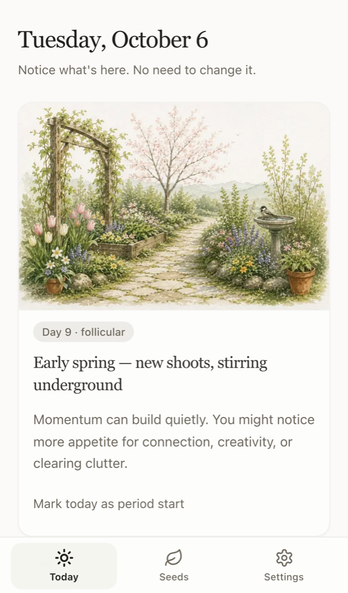
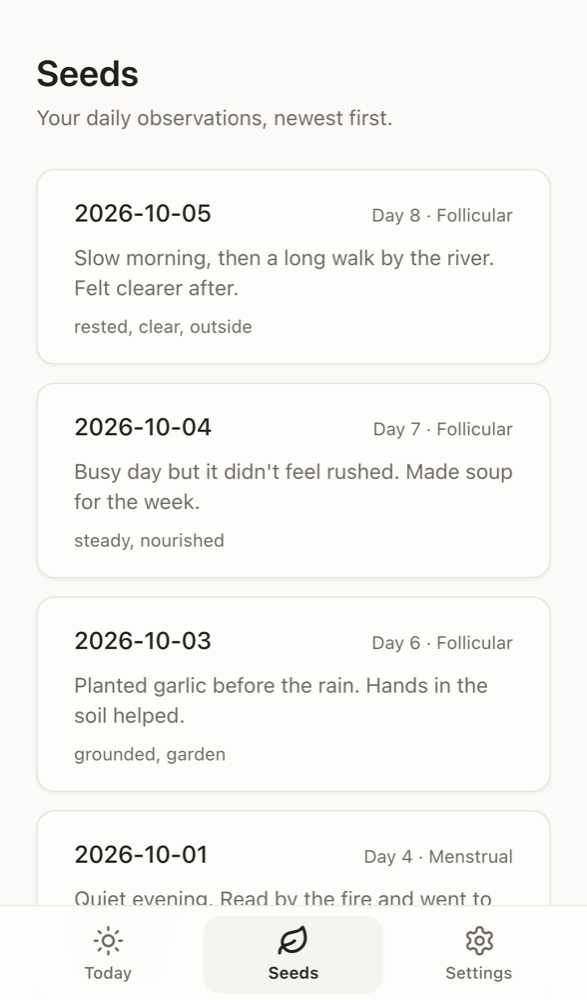
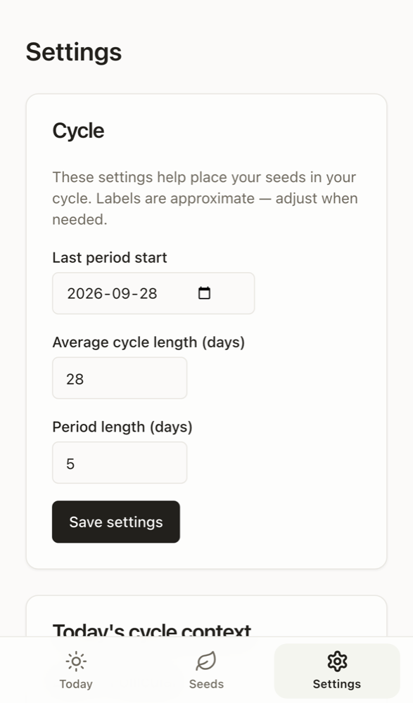

# Garden Within

A cycle-aware journal for daily reflection. Each day opens with a seasonal garden and a short note shaped by where you are in your cycle, then gives you one quiet question: *what stands out today?*

I built it for myself and use it daily on my phone. It's live at **[garden-within.vercel.app](https://garden-within.vercel.app)** (single-user, so it's password-protected).

<p>
  
  
  
</p>

<sub>Screenshots use sample data.</sub>

## Features

- **Today:** date, cycle day and phase, a seasonal garden image (winter, spring, summer for menstrual, follicular, ovulation) and a per-day prompt for all 28 days
- **Seeds:** one journal entry per day, with "margin" tags, browsable and editable by date
- **Cycle tracking:** cycle settings, period-start history, and a manual cycle-day override
- **Mobile-first PWA:** bottom nav, safe-area handling, Add to Home Screen

## Engineering notes

- **Thin server actions, real services.** Mutations are Next.js Server Actions that only parse input and call `lib/services`. Business logic never lives in a route, so a future API can reuse the same layer. See [docs/ARCHITECTURE.md](docs/ARCHITECTURE.md).
- **Cycle math as pure functions.** Cycle day, phase and the active period start are computed in `lib/services/cycle-service.ts` with no I/O, and unit-tested. Each entry stores the cycle context it was written in, so history doesn't shift when settings change.
- **One schema, two jobs.** Zod schemas in `lib/validations` validate every write and type the inputs.
- **Evolving the data model without a migration.** When the journal moved from four tag categories to a single margins field, old entries are merged at read time (`lib/journal-entry-form-data.ts`) instead of rewritten.
- **Login hardening.** Constant-time password comparison, plus a Postgres-backed failed-login limit (5 per 15 minutes per client). It's stored in the database because serverless instances don't share memory, and it's enforced inside `authorize()` so it also covers direct calls to the Auth.js endpoint.
- **CI against real Postgres.** GitHub Actions runs lint, Vitest and a full production build (including migrations) against a Postgres 16 service.

## Roadmap

Parked until daily use says otherwise:

- **Back-dating:** add or edit an entry for a past day, with the right cycle context for that date
- **Dictation:** speech-to-text in the journal field (Web Speech API first)
- **Roots and Blossoms:** weekly views and named patterns. The `Week` and `Blossom` models and routes exist from an earlier iteration but aren't in the nav yet.
- **Your patterns:** tag frequency by phase, replacing the generic phase guidance
- **Autumn art** for the luteal phase, which currently uses a stand-in image

## Stack

### Application

| Layer | Technology |
|-------|------------|
| Framework | [Next.js 15](https://nextjs.org) (App Router) |
| UI library | [React 19](https://react.dev) |
| Language | [TypeScript 5](https://www.typescriptlang.org) |
| Styling | [Tailwind CSS 3](https://tailwindcss.com), [PostCSS](https://postcss.org) |
| Components | shadcn-style primitives ([CVA](https://cva.style), [clsx](https://github.com/lukeed/clsx), [tailwind-merge](https://github.com/dcastil/tailwind-merge)) — Button, Input, Card |
| Icons | [Lucide React](https://lucide.dev) |
| Images | `next/image` + optimized WebP assets in `public/images/` |
| PWA | Web app manifest (`app/manifest.ts`) — Add to Home Screen on mobile |

### Data & API

| Layer | Technology |
|-------|------------|
| Database | [PostgreSQL](https://www.postgresql.org) |
| ORM | [Prisma 6](https://www.prisma.io) (migrations in `prisma/migrations/`) |
| Validation | [Zod 3](https://zod.dev) |
| Mutations | Next.js [Server Actions](https://nextjs.org/docs/app/building-your-application/data-fetching/server-actions-and-mutations) |
| Services | Server-side modules in `lib/services/` (cycle math, journal entries, settings) |

### Auth

| Layer | Technology |
|-------|------------|
| Library | [NextAuth.js v5](https://authjs.dev) (Auth.js) — credentials provider |
| Session | JWT (30-day), env-based single-user password (`AUTH_PASSWORD`) |
| Protection | `middleware.ts` guards all routes except `/login` and static assets |
| API route | `app/api/auth/[...nextauth]/route.ts` |

### Testing & quality

| Layer | Technology |
|-------|------------|
| Unit tests | [Vitest 2](https://vitest.dev) |
| Linting | [ESLint 9](https://eslint.org) + `eslint-config-next` |
| CI | GitHub Actions — lint, test, and production build against Postgres 16 |

### Deployment (production)

| Layer | Technology |
|-------|------------|
| App hosting | [Vercel](https://vercel.com) |
| Database | [Neon](https://neon.tech) (serverless PostgreSQL) |
| Build | `prisma migrate deploy` then `next build` on each deploy |
| Env vars | `DATABASE_URL`, `AUTH_SECRET`, `AUTH_PASSWORD` |

See **[docs/DEPLOYMENT.md](docs/DEPLOYMENT.md)** for step-by-step setup and [costs & free-tier limits](docs/DEPLOYMENT.md#costs--limits-free-tiers).

## Getting started

1. **Install and DB**
   ```bash
   npm install
   cp .env.example .env
   # Edit .env: DATABASE_URL, AUTH_SECRET (openssl rand -base64 32), AUTH_PASSWORD
   npm run db:migrate
   ```
2. **Run**
   ```bash
   npm run dev
   ```
   Open [http://localhost:3000](http://localhost:3000); you’ll be redirected to **Today**.

### Use on your phone (same Wi‑Fi)

1. Start the dev server so it accepts LAN connections:
   ```bash
   npm run dev:mobile
   ```
2. On your Mac, find your local IP (System Settings → Network, or `ipconfig getifaddr en0`).
3. On your phone’s browser, open `http://<your-ip>:3000` (e.g. `http://192.168.1.42:3000`).
4. **Add to Home Screen** (Safari: Share → Add to Home Screen) for an app-like full-screen experience.

For daily use away from home, see **[docs/DEPLOYMENT.md](docs/DEPLOYMENT.md)** for full deploy steps (Vercel + Neon + auth).

## Scripts

- `npm run dev` — development server
- `npm run dev:clean` — clear `.next` cache and start dev (use after `npm run build`)
- `npm run dev:mobile` — dev server on `0.0.0.0` for phone testing on LAN
- `npm run build` / `npm run start` — production build and server
- `npm run lint` — ESLint
- `npm run test` / `npm run test:watch` — Vitest
- `npm run db:generate` — regenerate Prisma client
- `npm run db:migrate` — create and run migrations (local dev)
- `npm run db:push` — push schema without migration files (prototyping only)
- `npm run db:studio` — Prisma Studio
- `npm run images:optimize` — resize garden art to WebP (see `scripts/optimize-garden-images.sh`)

## Structure

See [docs/FOLDER_STRUCTURE.md](docs/FOLDER_STRUCTURE.md) for the folder layout and [docs/ARCHITECTURE.md](docs/ARCHITECTURE.md) for main design decisions.
